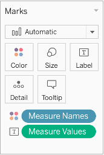

Mapping in Tableau Activity Guide

# Mapping in Tableau

Activity Guide

_With this activity guide you will create several maps and charts to explore the 2016 presidential election popular vote results. See the end of this document for data source information_

## Download the data: [go.ncsu.edu/tableau-mapping](https://go.ncsu.edu/tableau-mapping)

## Getting Started

1. Open Tableau Public (or Tableau Desktop)
2. In the "Connect Panel" under "To a File" select "Microsoft Excel"
3. Select "us_state_level_pres_elec_results_2016.xlsx"
4. The file will appear as a connection in the "Data Source" tab presented as a spreadsheet
5. Observe the dataset

## Create a bar graph

### Build a bar graph

1. Click on the "Sheet 1" tab to open a Worksheet view

2. Click and drag:

    1. "Measure Values" to the "Columns" field

    2. "Measure Names" to the "Rows" field

3. In the "Filters" card click on the "Measure Names" dropdown and select "Edit Filter..."

<div style="text-align: center;">
    
</div>

4. Select "None" to remove all values

5. Select "Democrat," "Republican," and "Other" and then click "OK"

6. Sort the bar chart in descending order using the "Sort Button"
<span style="text-align: center; vertical-align: middle;">
    
</span>

### Style the bar graph

<div style="text-align: center;">
    
</div>

1. Click and drag "Measure Names" to the "Color button" in the "Marks card"

2. Click on the "Color button", select "Edit Colors…" and change the ""Democrat" bar to blue, the ""Republican" bar to red, and the "Other" bar to orange

3. Click and drag "Measure Values" to "Label" in the "Marks card"

4. Click on the "Label button" and set "Horizontal" alignment to "Center"

5. Double-click on the x-axis title, "Value," and change the "Title" to "Total Votes"

6. Observe the bar graph

## Create state level choropleth maps

### Join a geojson spatial dataset

<div style="text-align: center;">
    
</div>

1. Click on the "Data Source" tab

2. In the "Connections" panel select "Add"

3. In the "Add a Connection popup menu" select "Spatial File"

4. Select "us_states_geo.geojson"

5. In the "Connections" panel under "Files" double-click "us_states_geo.geojson" to create a relation between the existing and new dataset.

6. In the "Edit Relationship" popup create a relationship using the "Fips" field from the "state_FIPS" dataset **equal to** the "State Fips" field from the newly added geojson file

7. Observe the data

### Color states by the political party that received the most votes

1. Create a new Worksheet by clicking the "Add Worksheet" icon

2. Double-click the "Geometry" field under "us_states_geo.geojson" in the data panel

3. Click and drag "Winner" to the "Color button" in the "Marks card"

4. Change the category colors on the map to match the bar chart

5. Observe the map

### Create a calculated field to represent vote margin

<div style="text-align: center;">
    
</div>

1. In the "Analysis menu" select "Create Calculated Field…"

2. Title the new calculation "Vote Margin"

3. Use the following calculation:

    ```
    [Democrat] - [Republican]
    ```

1. Click "OK" to create the new field

2. Observe the new field in the "Data Source" view (click on the "state_FIPS" logical table to view the table with this field)

### Color states using a diverging graduated color scale on vote margin

1. In "Sheet 2" drag the newly created "Vote Margin" to "Color" in the "Marks card"

2. Click the dropdown menu on the newly add "Vote Margin" field in the "Marks card" and select "Dimension" to set the role of this field as a continuous dimension

3. Click on the "Color button" in the "Marks card", select "Edit Colors…" and change the Palette to "Red-Blue-White Diverging"

4. Observe the map

## Create a county level choropleth map

### Connect to a new text file data source

<div style="text-align: center;">
    
</div>

1. Click on the "Data Source" tab

2. Click the "Change Data Source Button" and select "New Data Source"

3. Select "Text file" and open "county_level_election_results_2016.csv"

4. Observe the dataset. "County Name" has been given a "Geographic Role"

### Map data in a non-spatial file using a field with a geographic role

<div style="text-align: center;">
    
</div>

1. Create a new Worksheet by clicking the "Add Worksheet" icon

2. Double-click "County Name" to automatically populate our sheet with a map and georeferenced values (currently represented by dots)

3. In the "Marks card" select the dropdown and choose "Map" to create a map of county polygons

4. Observe the map. Tableau does a pretty good job of recognizing the names of places, like counties in this case. However, there are a few holes in our data that need to be fixed

### Fix missing geospatial references

<div style="text-align: center;">
    
</div>

1. In the bottom right-hand corner of the map click the "3 unknown" dialogue

2. Select "Edit locations…"

3. Use the dropdown menu in each row to find the likely matching location given the "Your Data" value

4. There is still one value in Alaska that is displayed as "Null". Using a Google search you found out it should be "Denali"... click "OK" when done

### Color the counties by the political party that received the most votes

1. Click and drag "Winner" to the "Color button"

2. Click the "Color button" and under "Effects" set the "Border" to "None"

3. Change the colors to match our previous visualizations

4. Observe the map

## Create a graduated symbol map

### Graph geospatial data

1. Create a new Worksheet by clicking the "Add Worksheet" icon

2. Double-click "County Name" to automatically populate our sheet with a map and georeferenced values

3. Color the dots by "Winner"

### Create a new measure of the total votes the winning party from each county received

1. In the "Analysis" menu select "Create Calculated Field…"

2. Title this new calculation "Winning Party"s Total Votes"

3. Put in the following calculation:

    ```
    IF [Votes Dem] > [Votes Gop] THEN
        [Votes Dem] ELSE
        [Votes Gop]
    END
    ```

4. Click "OK" to run the calculation

5. A new measure titled "Winning Party"s Total Votes" will appear under the "Measures panel"

6. Click and drag "Winning Party"s Total Votes" to the "Size button"

## Create another _county level_ choropleth map

### Connect to a new shape file data source

1. Click on the "Data Source" tab

2. Click the "Change Data Source Button" and select "New Data Source"

3. Select "Spatial file" and open "2016_us_county_pres_elec_w_CVAP.shp"

4. Click "Update Now" if the data table does not populate with values

5. Observe the dataset

### Map the counties/districts and color them using updated data

1. Create a new Worksheet by clicking the "Add Worksheet" icon

2. Double-click "County" to automatically populate our sheet with a map and georeferenced values. Observe the map. Alaska does not show up in this case since this dataset uses Alaska districts, which do not have a defined geographic role

3. In the "Worksheet menu" select "Clear" and then "Sheet"

4. Double-click "Geometry" to add the map of all the counties and Alaska districts

5. In the "Analysis" menu uncheck "Aggregate Measures"

6. Click and drag "Win Novote" to the "Color button"

7. Click the "Color button" and under "Effects" set the "Border" to "None"

8. Observe the map

## Create another bar graph

1. Create a new Worksheet by clicking the "Add Worksheet" icon

2. Click and drag:

    1. "Measure Values" to the "Columns" field

    2. "Measure Names" to the "Rows" field

3. In the "Filters" field click on the "Measure Names" dropdown and select "Edit Filter..."

4. Select "None" to remove all values

5. Select "DEM," "REP," "No Vote," and "Other" and then click "OK"

6. Sort the bar chart in descending order using the "Sort Button"

7. Change the category colors to match our previous charts and set "No Vote" to light teal

8. Observe the bar graph

## Data sources

us_state_level_pres_elec_results_2016.xlsx, modified from:

- MIT Election Data and Science Lab, 2017, &quot;U.S. President 1976–2016&quot;, [https://doi.org/10.7910/DVN/42MVDX](https://doi.org/10.7910/DVN/42MVDX), Harvard Dataverse, V5

us_states_geo.geojson:

- ArcGIS.com, 2012, &quot;states\_basic&quot;, [https://arcg.is/1DPSG4](https://arcg.is/1DPSG4)

county_level_election_results_2016.csv:

- 2016_US_County_Level_Presidential_Results.csv, [https://github.com/tonmcg/US\_County\_Level\_Election\_Results\_08-16/blob/master/2016\_US\_County\_Level\_Presidential\_Results.csv](https://github.com/tonmcg/US_County_Level_Election_Results_08-16/blob/master/2016_US_County_Level_Presidential_Results.csv)

2016_us_county_pres_elec_w_CVAP.shp, modified from:

- MIT Election Data and Science Lab, 2018, &quot;County Presidential Election Returns 2000-2016&quot;, [https://doi.org/10.7910/DVN/VOQCHQ](https://doi.org/10.7910/DVN/VOQCHQ), Harvard Dataverse, V6
- TIGER/Line Shapefile, 2016, nation, U.S., Current County and Equivalent National Shapefile, [https://catalog.data.gov/dataset/tiger-line-shapefile-2016-nation-u-s-current-county-and-equivalent-national-shapefile](https://catalog.data.gov/dataset/tiger-line-shapefile-2016-nation-u-s-current-county-and-equivalent-national-shapefile)
- Alaska Division of Elections, Statewide Precinct Shape files, [http://www.elections.alaska.gov/Core/districtmaps.php](http://www.elections.alaska.gov/Core/districtmaps.php)
- The U.S. Census Bureau, CVAP 2012-2016 5 Year ACS Data - CSV Format, [https://www.census.gov/programs-surveys/decennial-census/about/voting-rights/cvap.2018.html](https://www.census.gov/programs-surveys/decennial-census/about/voting-rights/cvap.2018.html)